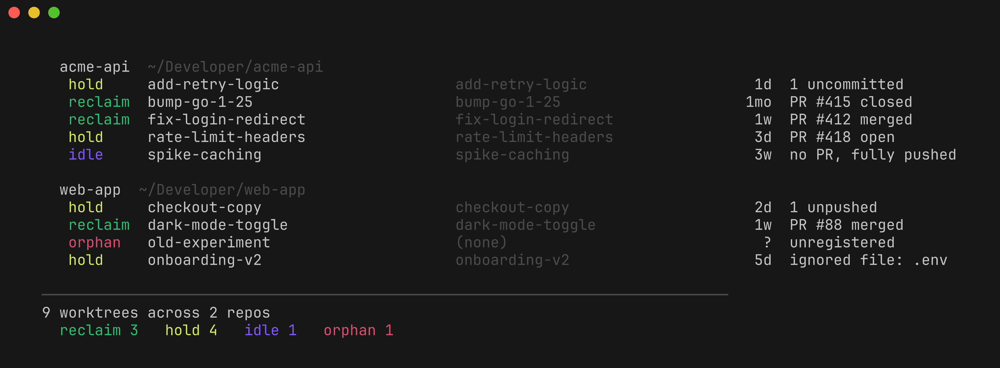

# warren

Find and safely remove leftover Claude Code git worktrees.

[](https://github.com/HikvIneH/warren/actions/workflows/ci.yml)
[](go.mod)
[](LICENSE)



## Why

Claude Code creates `<repo>/.claude/worktrees/<name>`, a full checkout, whenever it
isolates a task. Many get cleaned up, but the rest pile up: on the author's machine
there were 114 of them across 19 repos, about 12 GB.

warren finds them, works out which ones still hold something you would miss, and
removes only the rest. You may not need it: Claude Code now cleans up many of these
itself, and [mole](https://github.com/tw93/mole) will show you how much space the
remainder take. This is a small pet project shared in case it is useful; expect
rough edges.

## Features

- Scans every repo under your project directories and lists each Claude worktree
  with a keep-or-drop verdict and the reason.
- Detects merged and closed PRs, including squash merges, through `gh`.
- Holds anything with uncommitted changes, unpushed commits, secrets or local
  config in ignored files, a lock, a live process, or an open PR.
- Re-checks every worktree at the moment of deletion.
- `--json` output on `list`, `analyze`, `clean` and `prune`, plus a Claude Code
  skill so an agent can plan before it deletes.
- Single static Go binary. Needs only `git` (and optionally `gh`). A warm scan of
  114 worktrees takes about 3 seconds.

## Installation

Requires `git`; `lsof` for live-session detection (stock on macOS and most Linux);
optionally [`gh`](https://cli.github.com) for PR state. Without `gh`, everything
unmerged reads as `idle`. Tested in CI on macOS and Linux.

**With Go**

```sh
go install github.com/hikvineh/warren@latest
```

**Prebuilt binaries** for macOS and Linux (amd64, arm64) are published on the
[releases page](https://github.com/HikvIneH/warren/releases), built with GoReleaser.

**From a clone**: `install.sh` builds the binary, adds a `wr` alias and links the
Claude Code skill in one go.

```sh
git clone https://github.com/hikvineh/warren && cd warren && ./install.sh
```

**Claude Code plugin** (the skill only; install the binary separately):

```
/plugin marketplace add HikvIneH/warren
/plugin install warren@warren
```

## Quick start

```sh
warren list                  # every worktree, with a verdict
warren clean --dry-run       # preview what would be removed; changes nothing
warren clean                 # remove merged/closed worktrees, after confirming
```

Run `warren` with no arguments for an interactive menu.

## Usage

| Command | Description |
|---|---|
| `warren` | Interactive menu (falls back to `list` when stdin is not a terminal) |
| `warren list` | Every worktree with a verdict (aliases: `ls`, `status`) |
| `warren analyze` | Biggest repos, biggest worktrees, reclaimable total (alias: `disk`) |
| `warren clean` | Remove worktrees whose PR is merged or closed |
| `warren prune` | Fix stale git registrations and orphan directories |
| `warren path <name>` | Print a worktree's path, e.g. `cd "$(warren path my-feature)"` (alias: `cd`) |
| `warren paths` | Show or edit the directories to scan: `paths add <dir>`, `remove`, `reset` |
| `warren history` | What warren has removed (alias: `log`) |
| `warren completion` | Shell tab completion: `eval "$(warren completion)"` |
| `warren --help`, `--version` | Help and version |

| Flag | Applies to | Effect |
|---|---|---|
| `--here` | list, analyze, clean, prune, path | Only the repo you are in (works inside a worktree) |
| `--repo <path>` | list, analyze, clean, prune, path | Only the repo owning `<path>` |
| `--json` | list, analyze, clean, prune | Machine-readable output |
| `--dry-run`, `-n` | clean, prune | Preview; never delete |
| `--yes`, `-y` | clean, prune | Skip the confirmation prompt |
| `--idle` | clean | Also drop pushed worktrees that have no PR |
| `--branches` | clean | Also run `git branch -d` on the local branch (safe delete: git keeps a branch it considers unmerged, which includes squash-merged ones) |
| `--no-size` | clean | Skip measuring sizes |
| `--top N` | analyze | How many of the largest worktrees to show (default 15) |
| `--allow-ignored` | clean | Do not hold worktrees just for gitignored files (see the caveat under Safety guarantees) |
| `--only <verdict>` | list | Show one verdict; `--hold`, `--reclaim`, `--orphan` are shorthands |
| `--size`, `-s` | list | Measure disk usage too (slower) |

Examples:

```sh
warren list --hold           # only what is being protected, and why
warren list --only idle      # one verdict
warren clean --idle          # also drop pushed worktrees that have no PR
warren prune --dry-run       # stale registrations + orphan directories
```

### Verdicts

| Verdict | Meaning | Removed by |
|---|---|---|
| `reclaim` | PR merged or closed, tree clean, every commit on a remote | `clean` |
| `idle` | Clean and pushed, but no PR; your call | `clean --idle` only |
| `orphan` | A directory git no longer tracks | `clean` |
| `hold` | Holds work or is in use; see Safety guarantees | never |

### JSON and agents

`clean --json` and `prune --json` refuse to remove anything without `--yes` (exit
2; `--dry-run` is always allowed), so an agent has to plan before it can delete.
`list --json` and `analyze --json` print an array of worktree objects (`repo`,
`path`, `worktree`, `branch`, `dirty`, `unpushed`, `ignored`, `in_use`, `locked`,
`unreadable`, `pr_state`, `pr`, `verdict`, `reason`, `size_kb`, and so on). The
`clean` example below is abbreviated; the full document also has `reclaimed_kb`,
`removed`, `failed` and `skipped` counts, and each entry carries `repo`, `path`,
`branch`, `size_kb` and, when something went wrong, `detail`.

```sh
warren clean --dry-run --json --here
```
```json
{
  "dry_run": true, "scope": "/path/to/repo",
  "planned": 3, "reclaimable_kb": 35556, "held": 4, "idle": 2,
  "worktrees":      [{ "worktree": "fix-login-redirect", "verdict": "RECLAIM", "reason": "PR #412 merged", "outcome": "planned" }],
  "held_worktrees": [{ "worktree": "add-retry-logic",    "reason": "1 uncommitted" }],
  "idle_worktrees": [{ "worktree": "spike-caching",      "reason": "no PR, fully pushed" }]
}
```

`outcome` is `planned`, `removed`, `skipped` (the guard refused at deletion time)
or `failed` (git refused). Exit status: 0, or 1 if anything failed, or 2 if the
call was refused.

### Using it from Claude Code

With the skill installed you can say "use warren to clean up worktrees". Claude
scopes the scan (`--here` for the repo you are in), plans with
`warren clean --dry-run --json`, tells you what it would remove and what it is
holding back and why, and only then asks before executing. It will not pass
`--yes`, `--idle`, `--branches` or `--allow-ignored` on its own.

## Configuration

By default warren scans `~/Developer`, then `~/Projects`, `~/code`, `~/src`, then
`$HOME`. Change that with `warren paths add <dir>`, `warren paths remove <dir>` or
`warren paths reset`. The list is stored in `~/.config/warren/paths`.

| Variable | Effect |
|---|---|
| `WARREN_NO_GH=true` | Skip GitHub entirely; rely on git alone |
| `WARREN_JOBS=N` | Parallel git calls (default: number of CPUs) |
| `WARREN_PR_TTL=S` | PR cache lifetime in seconds (default 21600, six hours) |
| `WARREN_MAXDEPTH=N` | How deep to search for repos under each root (default 7) |
| `WARREN_CONFIG_DIR`, `WARREN_CACHE_DIR`, `WARREN_PATHS_FILE` | Override where config, cache and the paths file live (defaults follow `XDG_CONFIG_HOME` and `XDG_CACHE_HOME`) |
| `WARREN_NO_DEFAULT_ROOTS=1` | Never fall back to the default roots (used by the tests) |

## Safety guarantees

Deleting a worktree deletes a real checkout, so warren is deliberately paranoid.

A worktree is **held**, and no flag removes it, when any of these is true:

- it has uncommitted changes, including untracked files;
- it has commits that are on no remote (`git log HEAD --not --remotes`);
- it contains a gitignored file that looks like secrets or local config: `.env*`,
  `*.local`, `*.pem`/`*.key`, `id_rsa*`, `*.tfvars`, `*.sqlite`/`*.db`, `.npmrc`,
  `.netrc`, `terraform.tfstate`, and names containing `secret`, `credential`,
  `password` or `token`. It is an allowlist: directories, and anything inside
  `node_modules`, `dist`, `build`, `.venv`, `target` and similar cache directories,
  never count (`scan.go:219`);
- git has it locked (`git worktree lock`);
- a process owned by you has it (or a subdirectory) as its working directory: a live
  Claude session, a shell, an editor. This needs `lsof`; without it warren cannot see
  live sessions (`scan.go:140`);
- its PR is open;
- git cannot read it at all.

In addition:

- **The data-loss guard is git, not GitHub.** A clean tree and no commit outside the
  remotes holds with no network and no `gh`.
- **It re-checks at the moment of deletion.** The scan can be seconds stale, so every
  removal of a directory containing `.git` re-runs the unreadable, dirty, unpushed and
  ignored-file checks and skips it if anything turned up (`clean.go:19-32`). `--yes`
  does not bypass this. Lock, live-session and PR state are not re-checked here; git's
  own refusal covers locks.
- **Registered worktrees are only removed with `git worktree remove`** (no `--force`,
  no `rm -rf` fallback), so git's own refusals (locked, dirty, submodules) stand
  (`clean.go:42`). Only unregistered orphan directories are deleted directly, with
  `os.RemoveAll` (`clean.go:37`). They go through the guard above only if they contain
  a `.git`; an orphan without one is removed unconditionally.
- **Hold is decided before any flag applies.** `clean` only ever collects `reclaim` and
  `orphan` worktrees, plus `idle` ones with `--idle`; `hold` is never a candidate
  (`commands.go:309-323`).
- **One unreadable worktree does not hide the others.** It is reported as held
  (`scan.go:254`, `scan.go:312`).
- **Every removal is logged** to `~/.config/warren/history.log` (`warren history`
  shows the last 50 lines).

Two caveats:

- `--allow-ignored` stops the scan from holding on ignored files, but the
  deletion-time check still looks at them and skips the worktree with "ignored file
  appeared" (`clean.go:29`). In practice the flag only changes the verdict shown.
- `prune` (without `--dry-run`) runs `git worktree prune` for stale registrations
  before it asks for confirmation (`commands.go:443-449`); only the orphan directory
  deletion is gated by the prompt and `--yes`.

## How it works

1. Walk the configured roots (up to `WARREN_MAXDEPTH` levels, skipping `node_modules`,
   `vendor`, `Library` and similar) for repos with a non-empty `.claude/worktrees`
   (`scan.go:75`). Every subdirectory there is a worktree; one that `git worktree
   list` does not register is an orphan.
2. For each registered worktree, in parallel, run `git status --porcelain=v2 --branch
   --ignored=matching` and `git rev-list --count HEAD --not --remotes` to get dirty
   files, ignored files and commits on no remote, read lock state from `git worktree
   list --porcelain`, and check for processes inside it via one `lsof` call.
3. Look up the PR for the branch (its upstream name if it has one) with `gh`. Most
   repos squash on merge, so a merged branch is never an ancestor of `main` and
   `git branch --merged` reports nothing. One `gh pr list --state all --limit 400` per
   repo fills a cache for six hours; branches missing from it get one per-branch
   lookup. If `gh` fails, the stale cache is kept rather than wiped (`github.go`).
4. Classify each worktree in a fixed order (`scan.go:308`): unreadable, uncommitted,
   unpushed, precious ignored file, locked, live session and open PR all give `hold`;
   then merged or closed PR gives `reclaim`; otherwise `idle`. `clean` re-verifies each
   candidate, then removes it.

## Contributing

Issues and pull requests are welcome. Build and test with:

```sh
go build ./...
go test ./...
```

CI also runs `gofmt` and `go vet ./...`, so run those before opening a PR.

The suite builds a throwaway repo with one worktree per case (clean and pushed,
dirty, committed but on no remote, orphan, detached, locked, a gitignored `.env`, a
broken `.git` file, a process parked inside one) and asserts the verdicts and, above
all, that removal leaves every worktree holding work alone. It also covers the GitHub
path with a stubbed `gh`: merged, open and closed PRs, the per-branch fallback, and
that an offline `gh` keeps the stale cache instead of wiping it.

Tests never scan outside their fixture: every fixture writes an explicit paths file
and the test binary sets `WARREN_NO_DEFAULT_ROOTS`.

## License

MIT. See [LICENSE](LICENSE). Inspired by [mole](https://github.com/tw93/mole), but
shares no code with it.
